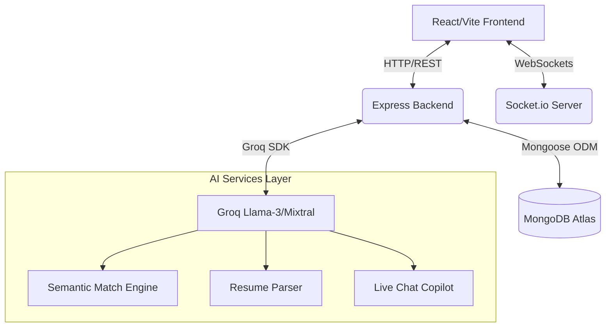

<div align="center">
  <a href="#">
    
  </a>
</div>

<h1 align="center">
  
</h1>

<div align="center">
  
  
  
  
  
  
  
  
</div>

<br/>

<div align="center">
  <p><b>ElevateHire</b> is a premium, full-stack recruitment platform designed to bridge the gap between world-class talent and top-tier companies. By leveraging cutting-edge Large Language Models (LLMs) via the Groq SDK, WebSockets for real-time reactivity, and a meticulously crafted glassmorphic user interface, ElevateHire completely redefines the modern job hunt.</p>
</div>

<div align="center">
  
</div>

## 🌟 Comprehensive Features

### 🧑‍💻 The Job Seeker Experience
*   **🧠 AI Match Scoring:** A sophisticated offline-capable semantic matching engine analyzes your skills against job requirements, instantly calculating a precise 0-100% match score alongside personalized reasoning.
*   **🤖 Live AI Career Coach & Negotiator:** An embedded AI chatbot headhunter offering on-the-fly salary negotiation tactics, tailored interview prep, and instant career advice.
*   **📄 AI Resume Studio:** Upload your PDF/DOCX and our AI automatically parses the content, optimizes your bullet points for Applicant Tracking Systems (ATS), and instantly generates tailored cover letters.
*   **🌙 Dynamic Fluid UI:** A glassmorphic design system that natively integrates with your operating system's dark/light mode preference with smooth, hardware-accelerated Framer Motion transitions.

### 🏢 The Employer & Admin Experience
*   **📊 Employer Copilot:** An intelligent dashboard sidekick that drafts job descriptions, summarizes thousands of applicant profiles into bite-sized actionable insights, and generates predictive hiring analytics.
*   **🔍 Semantic Intent Search:** Move past rigid keyword matching. Search for candidates using natural language (e.g., *"Find me a senior backend developer who knows about payment gateways"*).
*   **⚡ Real-Time Interviews:** Track candidate application statuses, shortlist profiles, and instantly dispatch interview schedules with live WebSocket notifications that push immediately to the candidate's screen.

<div align="center">
  
</div>

## 🏗️ System Architecture & Data Flow

Our platform is structured on a robust MERN stack architecture with a highly specialized AI integration layer.



### Advanced Security Protocols
*   **Helmet & HPP:** Secures HTTP headers and prevents HTTP Parameter Pollution attacks.
*   **Express Rate Limiter:** Protects against DDoS attacks and brute-force login attempts.
*   **BCrypt Hashing:** Implements rigorous salt rounds for user password cryptography.
*   **Route Guards:** Frontend protected routes dynamically check JWT verification tokens.

<div align="center">
  
</div>

## 🗺️ Core API Route Structure

| Endpoint | Method | Purpose |
| :--- | :--- | :--- |
| `/api/seeker/register` | `POST` | Registers a new job seeker and hashes credentials. |
| `/api/employer/jobs` | `POST` | Authenticated employers can publish new opportunities. |
| `/api/interviews` | `POST` | Triggers a live socket notification scheduling an interview. |
| `/api/ai/match` | `POST` | Analyzes array of jobs against seeker profile for fit scores. |
| `/api/ai/resume-parse` | `POST` | Processes multipart/form-data PDF/DOCX into clean JSON. |
| `/api/ai/chat` | `POST` | Initiates conversational context with the Negotiator Bot. |

<div align="center">
  
</div>

## 🚀 Ultimate Setup Guide

Follow these steps to launch the entire full-stack platform on your local machine.

### 1. Clone the repository
```bash
git clone https://github.com/Allen73737/job_portal07.git
cd job_portal07
```

### 2. Configure & Start the Backend
The backend runs on **Node.js (Express v5)** and connects to MongoDB and Groq AI.

```bash
cd Backend
npm install
```

Create a `.env` file in the root of the `Backend` folder to secure your credentials. *Do not commit this file to GitHub.*

```env
# /Backend/.env
MONGO_URI="your_mongodb_connection_string_here"
GROQ_API_KEY="your_groq_api_key_here"
PORT=5005
```

Start the backend development server:
```bash
npm run dev
```

### 3. Configure & Start the Frontend
The frontend runs on **React 18 + Vite** with TailwindCSS.

```bash
cd ../Frontend
npm install
```

Start the lightning-fast Vite development server:
```bash
npm run dev
```

Visit `http://localhost:5173` in your browser. The UI will automatically detect your OS Dark/Light mode!

<div align="center">
  
</div>

<div align="center">
  
</div>
